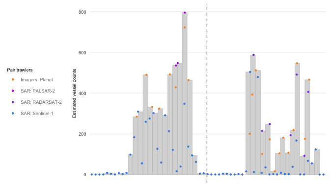
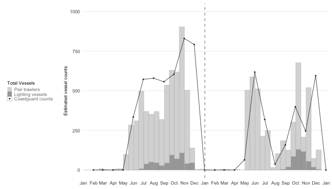
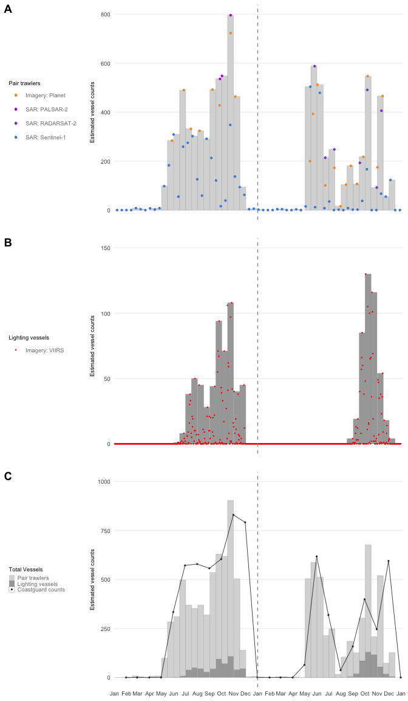

# Figure 4: Illuminating Dark Fishing Fleets in North Korea


Code for generating Figure 4 in the manuscript **Illuminating Dark Fishing Fleets in North Korea**


```r
library(tidyverse)
library(bigrquery)
library(cowplot)
library(lubridate)

BQ_connection <-  dbConnect(bigquery(), project = "global-fishing-watch", allowLargeResults = TRUE, use_legacy_sql = FALSE)
```


#### Query SAR, Planet, coast guard detection counts  


```sql
SELECT * FROM `global-fishing-watch.paper_dark_fishing_fleets_in_north_korea.daily_number_of_detections`
```

#### Query for VIIRS counts


```sql
SELECT * FROM `global-fishing-watch.paper_dark_fishing_fleets_in_north_korea.viirs_detection_daily`
```


#### Filter/Process Data

```r
#function to convert day-of-year to date
doy_to_date <- function(doy, year) {
  origin = as.Date(glue::glue('{year}-01-01'), tz = 'UTC') - lubridate::days(1)
  date_out <- as.Date(doy, origin = origin, tz = "UTC")
  date_out
}
```


```r
# filter the raw VIIRS to Chinese vessels
raw_chn_viirs <- all_viirs_counts %>%
  dplyr::filter(flag == 'chn' & sensor == 'viirs') %>%
  dplyr::mutate(date = doy_to_date(day_of_year, year))

# filter raw VIIRS to North Korean vessels
raw_prk_viirs <- all_viirs_counts %>%
  dplyr::filter(flag == 'prk' & sensor == 'viirs') %>%
  dplyr::mutate(date = doy_to_date(day_of_year, year))

# filter summarized VIIRS/SAR/Planet to Chinese
china_detection_counts <- detection_counts %>%
  dplyr::filter(flag == 'chn') %>%
  dplyr::mutate(date = doy_to_date(day_of_year, year),
         month = as.numeric(format(date, '%m')),
         day = format(date, '%d'),
         month_half = ifelse(day < 16, 'first', 'second'),
         bin = interaction(month, month_half, year)) 

# filter summarized data to planet
planet <- china_detection_counts %>%
  dplyr::filter(sensor == 'planet') %>%
  dplyr::group_by(bin) %>%
  dplyr::summarize(counts = max(detection)) %>%
  dplyr::select( bin, counts)

# fllter summarized data to VIIRS
viirs <- china_detection_counts %>%
  dplyr::filter(sensor == 'viirs') %>%
  dplyr::select(year, date, bin, sensor, detection) %>%
  dplyr::rename(sensor_type = sensor, counts = detection)

# filter summarized data to Sentinel-1
sentinel <- china_detection_counts %>%
  dplyr::filter(sensor == 'sentinel1') %>%
  dplyr::group_by(bin) %>%
  dplyr::summarize(counts = max(detection)) %>%
  dplyr::select(bin, counts)

# filter summarized data to Radarsat-2
radarsat <- china_detection_counts %>%
  dplyr::filter(sensor == 'radarsat2') %>%
  dplyr::group_by(bin) %>%
  dplyr::summarize(counts = max(detection)) %>%
  dplyr::select( bin, counts)


# filter summarized data to Palsar-2
palsar <- china_detection_counts %>%
  dplyr::filter(sensor == 'palsar2') %>%
  dplyr::group_by(bin) %>%
  dplyr::summarize(counts = max(detection)) %>%
  dplyr::select( bin, counts)

# generate the binned sensor data
sensor_count_data <- viirs %>%
  dplyr::left_join(planet, by = c('bin' = 'bin')) %>%
  dplyr::left_join(sentinel, by = c('bin' = 'bin')) %>%
  dplyr::left_join(radarsat, by = c('bin' = 'bin')) %>%
  dplyr::left_join(palsar, by = c('bin' = 'bin')) %>%
  dplyr::select(year, date,  bin, counts.x,  counts.y, 
                counts.x.x, counts.y.y, counts ) %>%
  dplyr::rename( viirs = counts.x, planet = counts.y,  
                 sentinel = counts.x.x,  radarsat = counts.y.y,
                 palsar = counts)


# generate barplot sensor count dataframe
barplot_data <- sensor_count_data %>%
  rowwise() %>%
  dplyr::mutate(total_count = viirs + 
                  max(c(planet, sentinel, radarsat, palsar), na.rm = TRUE),
        total_count = ifelse(viirs == total_count, NA, total_count)) %>%
  dplyr::mutate(pairs = total_count - viirs) %>%
  dplyr::select(date, bin, viirs, pairs, total_count) %>%
  tidyr::gather(sensor, counts, -c(date, bin)) %>%
  dplyr::mutate(year = format(date, '%Y'),
         month = as.numeric(format(date, '%m')),
         day = format(date, '%d'),
         day = ifelse(day < 16, '09', '24'),
         date = glue::glue('{year}-{month}-{day}'),
         date = as.Date(date, tz = 'UTC')) 

# subset to sensors for appropriate date plotting
planet_points <- china_detection_counts %>%
  dplyr::filter(sensor == "planet") %>%
  dplyr::inner_join(planet, by = "bin")
palsar_points <- china_detection_counts %>%
  dplyr::filter(sensor == "palsar2") %>%
  dplyr::inner_join(palsar, by = "bin")
sentinel_points <- china_detection_counts %>%
  dplyr::filter(sensor == "sentinel1") %>%
  dplyr::inner_join(sentinel, by = "bin")
radarsat_points <- china_detection_counts %>%
  dplyr::filter(sensor == "radarsat2") %>%
  dplyr::inner_join(radarsat, by = "bin")

# filter for coast guard data
coast_guard <- china_detection_counts %>%
  dplyr::filter(sensor == "coastguard")
```

#### Generate Figure 4, Panel A

```r
# bar plot colors
cols = c('#D9D9D9', '#A8A8A8')

#make plot
(figure4_panel_A1 <- ggplot() +
  geom_col(data = barplot_data %>%
             filter(sensor == 'pairs'),
           aes(date, 
               counts),
           fill = cols[1],
           width = 15.5, 
           color = 'grey60',
           size = 0.1) +
  geom_point(data = planet_points, 
             aes(date,
                 detection, 
                 color = 'Imagery: Planet'), 
             size = 0.8) +
  geom_point(data = palsar_points, 
             aes(date, 
                 detection,
                 color = 'SAR: PALSAR-2'), 
             size = 0.8) +
  geom_point(data = sentinel_points, 
             aes(date, 
                 detection,
                 color = 'SAR: Sentinel-1'), 
             size = 0.8) +
  geom_point(data = radarsat_points,
             aes(date, 
                 detection, 
                 color = 'SAR: RADARSAT-2'), 
             size = 0.8) +
  scale_x_date('', date_breaks = 'month', 
               date_labels = '%b',
               limits = c(as.Date('2017-01-01'), 
                          as.Date('2018-12-31')), 
               expand = expand_scale(mult = c(0,0.01))) +
   scale_y_continuous("Estimated vessel counts",
                      limits = c(0, 800), 
                      breaks = seq(0, 800, 200),
                      labels = c('0','200','400','600', '800')) +
  scale_color_manual('Pair trawlers',
                     values = c( 'Imagery: Planet' = '#F89938', 
                                 'SAR: Sentinel-1' = '#4A90E2',
                                 'SAR: PALSAR-2' = '#BD10E0',
                                 'SAR: RADARSAT-2' = '#8F4AE2')) +

  geom_vline(xintercept = as.Date('2018-01-01', tz = 'UTC'), 
             linetype = 'dashed', 
             color = 'grey60') +
   theme_minimal() +
  theme(panel.grid.minor = element_blank(),
        panel.grid.major.x = element_blank(),
        panel.grid.major.y = element_line(color = 'grey95'),
        axis.title.x = element_blank(),
        axis.text.x = element_blank(),
        legend.position = 'left',
        legend.direction = 'vertical',
        legend.title = element_text(color = 'black', size = 7),
        legend.justification = 0,
        plot.margin = margin(c(5.5, 5.5, 5.5, 5.5),unit = 'pt'),
        legend.background = element_rect(fill = NA, color = NA),
        axis.text = element_text(size = 7),
        axis.title = element_text(size = 7),
        legend.text = element_text( size = 7, color = 'grey50'))
)
```

<!-- -->

#### Generate Figure 4, Panel B


```r
(figure4_panel_A2 <- ggplot() +
  geom_col(data = barplot_data %>% 
             filter(sensor == 'viirs'),
           aes(date, 
               counts),
           fill = cols[2],
           width = 15.5, 
           color = 'grey60', 
           size = 0.1) +
  geom_point(data = raw_chn_viirs,
             aes(date,
                 detection,
             color = sensor),
             size = 0.1) +
  scale_x_date('', date_breaks = 'month', 
               date_labels = '%b',
               limits = c(as.Date('2017-01-01'), 
                          as.Date('2018-12-31')), 
               expand = expand_scale(mult = c(0,0.01))) +
   scale_y_continuous("Estimated vessel counts",
                      limits = c(0, 150), 
                      breaks = seq(0, 150, 50),
                      labels = c('0','50','100','150')) +
  scale_color_manual('Lighting vessels',
                     breaks = c('viirs'),
                     values = c( 'red'),
                     labels = c('Imagery: VIIRS')) +
  geom_vline(xintercept = as.Date('2018-01-01', tz = 'UTC'), 
             linetype = 'dashed', 
             color = 'grey60') +
  theme_minimal() +
  theme(panel.grid.minor = element_blank(),
        panel.grid.major.x = element_blank(),
        panel.grid.major.y = element_line(color = 'grey95'),
        axis.title.x = element_blank(),
        axis.text.x = element_blank(),
        legend.position = 'left',
        legend.direction = 'vertical',
        legend.title = element_text(color = 'black', size = 7),
        legend.justification = 0,
        plot.margin = margin(c(5.5, 5.5, 5.5, 5.5),unit = 'pt'),
        legend.background = element_rect(fill = NA, color = NA),
        axis.text = element_text(size = 7),
        axis.title = element_text(size = 7),
        legend.text = element_text( size = 7, color = 'grey50'))
)
```

<!-- -->


#### Generate Figure 4, Panel C


```r
(figure4_panel_A3 <- ggplot() +
  geom_col(data = barplot_data %>% 
             filter(sensor != 'total_count'), 
           aes(date,
               counts,
               fill = sensor), 
           width = 15.5, 
           color = 'grey60',
           size = 0.1) +
  geom_line(data = coast_guard,
             aes(date, detection, group = 1),
             color = 'grey20',
             linetype = 'solid',
             size = 0.3) +
  geom_point(data = coast_guard,
             aes(date, 
                 detection, 
                 group = 1, 
                 fill = 'Coastguard Counts'), 
             size = 0.8, 
             shape = 16, 
             color = 'grey20') +
  scale_fill_manual("Total Vessels",
                    values = c('pairs' = cols[1],
                               'viirs' = cols[2],
                               'Coastguard Counts' = 'black'),
                    labels = c('Pair trawlers',
                               'Lighting vessels', 
                               'Coastguard counts')) +
  scale_y_continuous("Estimated vessel counts",
                     limits = c(0, 1000), 
                     breaks = seq(0,1000, 250)) +
  scale_x_date(date_breaks = 'month', 
               date_labels = '%b', 
               limits = c(as.Date('2017-01-01', tz = 'UTC'), 
                          as.Date('2018-12-31', tz = 'UTC')),
               expand = expand_scale(mult = c(0,0.01)) ) +
  geom_vline(xintercept = as.Date('2018-01-01', tz = 'UTC'), 
             linetype = 'dashed', 
             color = 'grey60') +
  guides(fill = guide_legend(override.aes = list(shape = c(NA, NA, 16),
                                                 fill = c(cols[1], cols[2], NA),
                                                 color = c(NA, NA, 'grey20')))) +
  theme_minimal() +
  theme(panel.grid.minor = element_blank(),
        panel.grid.major.x = element_blank(),
        panel.grid.major.y = element_line(color = 'grey95'),
        axis.title.x = element_blank(),
        legend.position = 'left',
        legend.direction = 'vertical',
        legend.justification = 0,
        legend.key.size = unit(0.5,"line"),
        legend.key = element_blank(),
        legend.background = element_rect(fill = 'white', color = NA),
        legend.title = element_text(color = 'black', size = 7),
        plot.margin = margin(c(5.5, 5.5, 5.5, 5.5),unit = 'pt'),
        axis.text = element_text(size = 7),
        axis.title = element_text(size = 7),
        legend.text = element_text( size = 7, color = 'grey50'))
)
```

<!-- -->

#### Combined the first three panels together


```r
(figure4A_total <- cowplot::plot_grid(figure4_panel_A1,figure4_panel_A2,figure4_panel_A3, 
                                     align = 'hv', 
                                     rel_heights = c(1,1,1), 
                                     ncol = 1, 
                                     labels = c('A','B','C')))
```

<!-- -->


```r
cowplot::ggsave('figure_4A_total.pdf', 
                figure4_A_total, 
                width = 8, 
                height = 6,
                dpi = 400, 
                units = 'in')
```


#### Making Panel D


```r
# Filter detection counts to North Korea
# to make bars

detection_counts_prk <- detection_counts %>%
  dplyr::filter(flag == 'prk') %>%
  dplyr::mutate(date = doy_to_date(day_of_year, year))

detection_counts_prk <- detection_counts_prk %>%
  #filter(day_of_year > 120) %>%
  dplyr::mutate(month = as.numeric(format(date, '%m')),
        day = format(date, '%d'),
        month_half = ifelse(day < 16, 'first', 'second'),
        bin = interaction(month, month_half)) 
```


```r
# specify a new x-axis with breaks
insert_minor <- function(major_labs, n_minor) {
  labs <- 
    c( sapply( major_labs, function(x) c(x, rep("", 11) ) ) )
  labs[1:(length(labs) - n_minor)]
  }

date_br1 <- seq(from = as.Date('2015-01-01', tz = 'UTC'), 
                to = as.Date('2019-01-01', tz = 'UTC'), 
                by = "1 month")
date_br5 <- seq(from = as.Date('2015-01-01', tz = 'UTC'), 
                to = as.Date('2019-01-01', tz = 'UTC'), 
                by = "1 year")

# plotting panel D
(figure4_panel_B <- ggplot() +  
  geom_col(data = detection_counts_prk, 
           aes(date, 
               detection),
           size = 0.5, 
           fill = cols[2], 
           width = 15.5) +
   geom_vline(xintercept = date_br5, 
              color = 'grey90') + 
  geom_point(data = raw_prk_viirs, 
             aes(date, 
                 detection, 
                 color = 'Imagery: VIIRS'), 
             size = 0.4) +
   scale_color_manual("North Korean vessels", 
                      values = c('Imagery: VIIRS' = '#F5CB6A')) +
    scale_y_continuous('Estimated North Korean Vessels', 
                       limits = c(0, 1100), 
                       breaks = seq(0, 1000, 250)) +
   scale_x_date('', 
                date_breaks = 'year', 
                date_labels = '%Y', 
                limits = c(as.Date('2015-01-01'), 
                           as.Date('2019-01-01')), 
                expand = c(0,0.01)) +
   theme_minimal() +
   theme(panel.grid.minor = element_blank(),
        panel.grid.major.y = element_blank(),
        panel.grid.major.x = element_line(color = 'grey95'),
        axis.title.x = element_blank(),
        axis.ticks.x = element_line(color = 'grey80'),
        legend.position = 'left',
        legend.text = element_text( size = 7, color = 'grey50'),
        legend.title = element_text(color = 'black', size = 7),
        plot.margin = margin(c(5.5, 5.5, 5.5, 30),unit = 'pt'),
        legend.justification = 0,
        legend.key.size = unit(0.5,"line"),
        legend.margin = margin(c(1,1,1,1),unit = 'pt'),
        legend.key = element_blank(),
        legend.background = element_rect(fill = 'white', color = NA),
        axis.text = element_text(size = 7),
        axis.title = element_text(size = 8))
)
```

<!-- -->
 
 

```r
cowplot::ggsave('figure_4c_plot_bar.png',
                figure4_panel_B,
                width = 8,
                height = 3.5,
                dpi = 400,
                units = 'in')
```


#### Combine panels ABC with panel D

```r
(figure_4AB_total <- cowplot::plot_grid(figure4A_total,figure4_panel_B, 
                                       align = 'hv', 
                                       rel_heights = c(1,0.35), 
                                       ncol = 1, 
                                       labels = c(NA,'D')))
```

<!-- -->

#### Export Final Plot

```r
cowplot::ggsave('figure_4AB_total_panel2.pdf', 
                figure_4AB_total, 
                width = 8, 
                height = 8,
                dpi = 400, 
                units = 'in')
```


